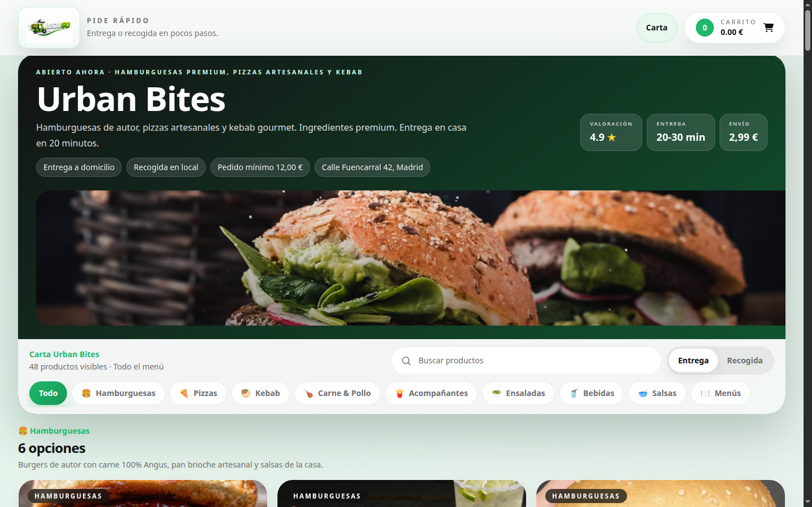
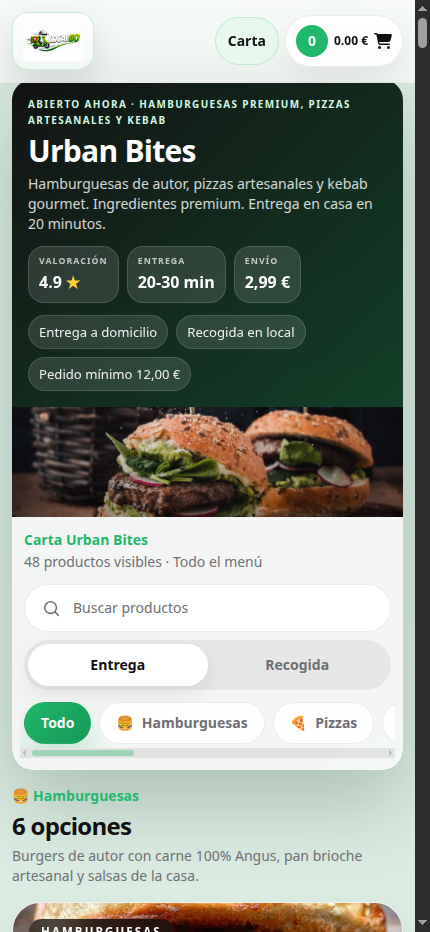
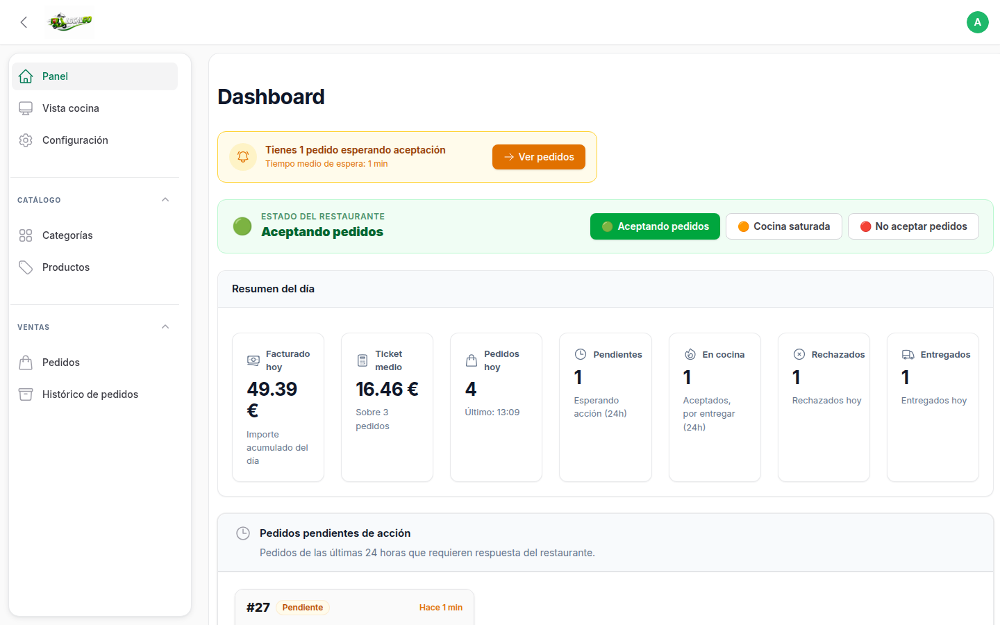
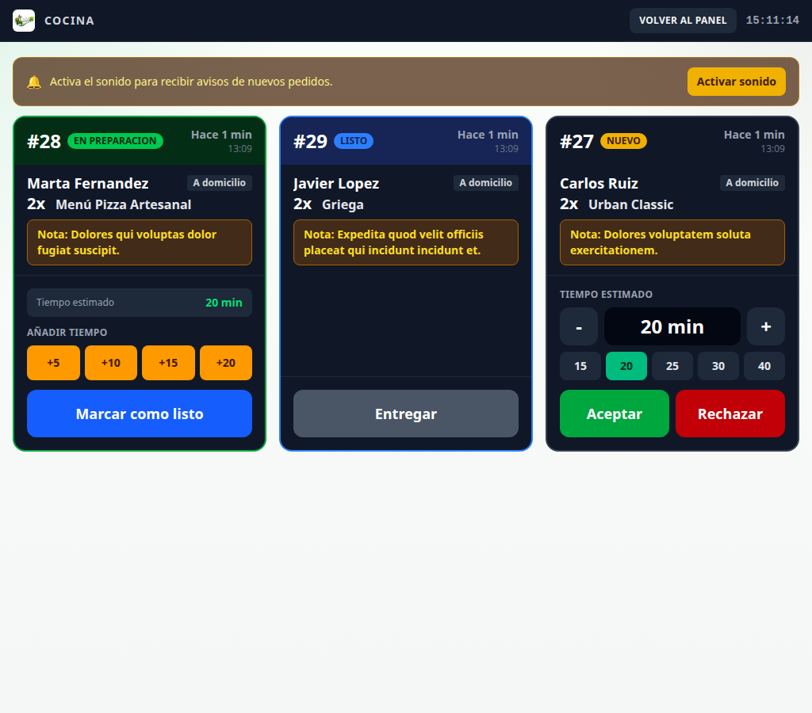
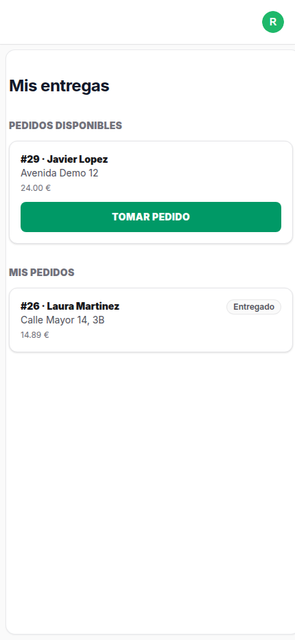

<div align="center">

# LocalGo

**Plataforma de pedidos online para negocios de comida local.**
Carta digital, carrito, checkout con pago en efectivo o tarjeta, panel de
gestión en tiempo real y vista dedicada para cocina y repartidores.

[](https://www.php.net/)
[](https://laravel.com)
[](https://filamentphp.com)
[](LICENSE)

</div>

<p align="center">
  <br>
  
  
</p>
<p align="center">
  
  
</p>

## Qué resuelve

Cualquier restaurante, pollería, kebab, hamburguesería o local similar puede
enseñar su carta online, recibir pedidos sin llamadas ni mensajes confusos, y
gestionar todo desde un panel sencillo — sin depender de apps de terceros que
se llevan comisión por pedido.

De cara al cliente: navegar la carta por categorías, armar el pedido con
opciones dinámicas (bebidas, salsas en menús/combos), elegir domicilio o
recogida, pagar en efectivo o con tarjeta, y confirmar por email.

De cara al negocio: ver los pedidos entrar en tiempo real, aceptarlos o
rechazarlos, seguimiento en cocina, asignación a repartidores, y control de
facturación diaria e histórica desde un panel de administración.

## Funcionalidades principales

- 🛒 Carta digital por categorías con carrito persistente en sesión
- 🍹 Opciones dinámicas de bebidas/salsas para menús y combos
- 📍 Pedido a domicilio o para recoger, con notas y dirección
- 💳 Pago en efectivo o tarjeta (Stripe Checkout)
- ✉️ Confirmación de pedido por email antes de que llegue a cocina (evita spam/pedidos falsos)
- 📡 Actualizaciones en tiempo real vía WebSockets (Laravel Reverb)
- 👨‍🍳 Vista de cocina para aceptar/rechazar pedidos y marcarlos como listos
- 🛵 Vista de repartidor (PWA instalable) para tomar entregas y marcarlas como entregadas
- 🛠️ Panel admin (Filament) con gestión de productos, categorías, pedidos y facturación diaria/histórica

## Stack técnico

| Capa | Tecnología |
|---|---|
| Backend | Laravel 13 · PHP 8.3 |
| UI reactiva | Livewire 4 |
| Panel admin | Filament 5 |
| Tiempo real | Laravel Reverb (WebSockets) |
| Pagos | Stripe Checkout |
| Email transaccional | Resend |
| Estilos | Tailwind CSS 4 |
| Frontend build | Vite |

Ver [docs/ARQUITECTURA.md](docs/ARQUITECTURA.md) para el razonamiento detrás
de estas elecciones y cómo están organizados los módulos.

## Instalación y ejecución local

### Requisitos

- PHP 8.3+ con extensiones habituales de Laravel
- Composer 2
- Node.js 18+ y npm
- MySQL (o usa el modo SQLite, ver abajo — no requiere nada extra)

### Opción rápida: script todo-en-uno

```bash
git clone git@github.com:<tu-usuario>/LocalGo.git
cd LocalGo
bash scripts/local-deploy.sh --sqlite
```

Esto instala dependencias PHP/JS, crea `.env` con SQLite si no existe, genera
`APP_KEY`, ejecuta migraciones + seeders, compila assets, y levanta en segundo
plano: servidor Laravel, Reverb, cola, logs (Pail) y Vite.

La app queda disponible en `http://127.0.0.1:8010`.

Para pararlo todo:

```bash
bash scripts/local-stop.sh
```

Otras opciones del script: `--fresh` (recrea la BD), `--no-seed`,
`--no-build`, `--no-start` (deja todo preparado sin arrancar procesos).

### Opción manual

```bash
composer install
npm install

cp .env.example .env
php artisan key:generate
php artisan migrate --seed
php artisan storage:link

composer dev
```

`composer dev` levanta en paralelo Laravel, Reverb, la cola y Vite, así que
los pedidos en tiempo real funcionan también en desarrollo.

### Credenciales de prueba (tras el seeder)

| Rol | URL | Email | Password |
|---|---|---|---|
| Admin | `/admin` | `admin@localgo.local` | `password` |
| Repartidor | `/repartidor` | `repartidor@localgo.local` | `password` |

## Variables de entorno

Todas las variables necesarias están documentadas con placeholders en
[`.env.example`](.env.example). Las más relevantes:

| Variable | Para qué sirve |
|---|---|
| `DB_*` | Conexión a base de datos (o usa `--sqlite` en el script de deploy) |
| `RESEND_API_KEY` | Envío de emails transaccionales (confirmación de pedido) |
| `STRIPE_KEY` / `STRIPE_SECRET` / `STRIPE_WEBHOOK_SECRET` | Pago con tarjeta |
| `REVERB_*` | Credenciales del servidor de WebSockets para tiempo real |
| `ADMIN_EMAIL` | Email que recibe notificación de cada pedido confirmado |

En local sin necesidad de enviar emails reales: `MAIL_MAILER=log` escribe el
contenido del email en los logs en vez de llamar a Resend.

## Estructura del proyecto

```
app/
├── Livewire/            Componentes de página completa: Storefront, Cart, KitchenDisplay
├── Filament/             Panel admin (Resources, Pages, Widgets) + panel de repartidor
│   └── Repartidor/       Página "Mis entregas" del panel de repartidor
├── Http/Controllers/Api  Endpoints públicos: productos, categorías, pedidos, Stripe
├── Services/             Lógica de negocio (OrderService, StripeCheckoutService...)
├── Models/               Eloquent: Order, Product, Category, User...
├── Enums/                Estados tipados: OrderStatus, DeliveryType, PaymentStatus...
├── Observers/             Efectos al cambiar un pedido (broadcast en tiempo real, emails)
└── Events/                Eventos de broadcasting (OrderUpdated)

database/
├── migrations/           Esquema de base de datos
└── seeders/               Datos de ejemplo (categorías, productos, usuarios demo)

resources/
├── views/livewire/       Vistas Blade de los componentes Livewire
├── views/filament/        Vistas custom de páginas Filament
└── js|css/                 Assets del frontend (Vite)

routes/
├── web.php               Rutas públicas + vista de cocina
├── api.php                API pública y de administración
└── channels.php            Autorización de canales de broadcasting

docs/
└── ARQUITECTURA.md        Decisiones técnicas y diseño en detalle
```

## Ejemplos de uso: endpoints principales

```http
GET  /api/products                          # Catálogo público
GET  /api/categories                        # Categorías públicas
POST /api/orders                             # Crear pedido desde el carrito
POST /api/orders/{public_id}/resend-email     # Reenviar email de confirmación
POST /api/stripe/create-checkout-session      # Iniciar pago con tarjeta
POST /api/stripe/webhook                      # Webhook de Stripe (firmado)

# Autenticados como admin
GET   /api/admin/orders                       # Pedidos visibles para el negocio
PATCH /api/admin/orders/{order}/accept
PATCH /api/admin/orders/{order}/reject
PATCH /api/admin/orders/{order}/delivered
```

## Arquitectura y decisiones técnicas

Resumen rápido — el detalle completo está en
[docs/ARQUITECTURA.md](docs/ARQUITECTURA.md):

- **Livewire en vez de una SPA separada**: menos superficie, un solo
  codebase, suficiente interactividad para carrito/checkout/cocina sin pagar
  el coste de mantener una API + frontend desacoplados.
- **Un panel de Filament por rol** (`admin`, `repartidor`), no uno solo con
  permisos condicionales — navegación y páginas completamente aisladas por
  rol en vez de lógica de visibilidad dispersa por la UI.
- **Confirmación de pedido por email antes de llegar a cocina**: filtra
  pedidos falsos/erróneos sin exigir registro de usuario.
- **Estados como enums nativos de PHP** (`OrderStatus`, `DeliveryType`...) en
  vez de strings sueltos, con helpers tipados para qué estados ve cada rol.
- **Reverb en vez de un servicio de terceros**: tiempo real first-party sin
  dependencia externa ni coste por conexión.

## Roadmap

- [ ] Gestión de repartidores desde el panel admin (sin pasar por `tinker`)
- [ ] Soporte multi-tenant (varios locales en una misma instalación)
- [ ] Reporting histórico más allá del resumen diario actual

## Licencia

[MIT](LICENSE) — libre para usar, modificar y reutilizar.
